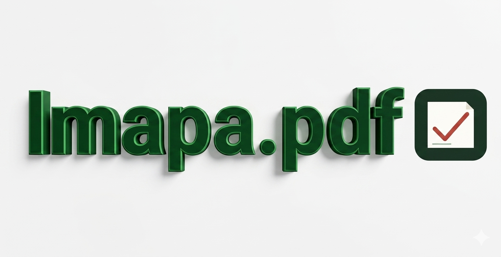

# 📄 De tu cuaderno al documento APA 7

> Convertí fotos de tu cuaderno manuscrito a un documento PDF con formato APA 7,
> listo para subir a plataformas educativas.



**🌐 Demo:** [imapa-pdf.onrender.com](https://imapa-pdf.onrender.com)

---

## Cómo funciona

**Dos modos, sin registro, todo en el navegador:**

### 📝 Modo transcripción (IA)

1. **Fotografiá** cada página de tu cuestionario (varias fotos, en orden)
2. **IA transcribe** — Gemini 3.1 Flash Lite lee el texto manuscrito y lo estructura en título + secciones
3. **Revisá dudas** — palabras que la IA no leyó con certeza se marcan en amarillo; tocándolas las corregís
4. **Descargá PDF** — completá los datos de carátula y obtené el documento con formato APA 7

> La IA **transcribe, no redacta**: no corrige ortografía, no completa ideas,
> no inventa contenido que no esté en la foto. Si hay duda, la marca y te pregunta.

### 📷 Modo imagen directa

1. **Fotografiá** cada página de tu desarrollo manuscrito (álgebra, cálculos, gráficos)
2. **Completá** los datos de carátula (instituto, participante, tema, etc.)
3. **Descargá PDF** con las imágenes insertadas directamente, cada una en su propia página con el encabezado "Desarrollo del ejercicio"

> Ideal para materias como matemáticas donde el profesor exige ver el desarrollo manuscrito. La imagen se coloca tal cual en el PDF, sin IA de por medio.

---

## Stack

| Capa     | Tecnología                       |
| -------- | -------------------------------- |
| Frontend | Vue 3 + TypeScript + Vite        |
| Backend  | Node.js + Express                |
| IA       | Google Gemini 3.1 Flash Lite     |
| PDF      | jsPDF (directo, sin html2canvas) |
| Deploy   | Render                           |

---

## Correr en local

```bash
# 1. Clonar
git clone https://github.com/johnb03/Imapa.pdf.git
cd Imapa.pdf

# 2. Configurar API key
cd server
cp .env.example .env   # o creá .env con GEMINI_API_KEY=tu_key
cd ..

# 3. Instalar dependencias (frontend + server)
npm install

# 4. Iniciar (server + frontend dev)
# Terminal 1:
npm start              # server en :3001
# Terminal 2:
npm run dev            # frontend en :5173
```

Después abrí `http://localhost:5173` — Vite proxyea `/api` al server automáticamente.

### Variables de entorno (`server/.env`)

| Variable         | Obligatoria | Descripción                                                       |
| ---------------- | ----------- | ----------------------------------------------------------------- |
| `GEMINI_API_KEY` | ✅          | API key de [Google AI Studio](https://aistudio.google.com/apikey) |
| `PORT`           | ❌          | Puerto del server (default 3001)                                  |

---

## Deploy en Render

El proyecto está configurado para deploy automático desde GitHub:

1. Conectá el repo en Render como **Web Service**
2. Build command: `npm install` (corre `postinstall` que instala `server/`)
3. Start command: `npm start` (ejecuta `server/index.js`)
4. Agregá `GEMINI_API_KEY` en Environment Variables

El server Express sirve el frontend compilado desde `dist/` en producción.

---

## Estructura del proyecto

```
Imapa.pdf/
├── index.html              # Entry HTML
├── package.json            # Vue 3 + Vite + scripts
├── vite.config.ts          # Proxy /api → :3001
├── server/
│   ├── index.js            # Express proxy a Gemini
│   ├── package.json
│   └── .env                # GEMINI_API_KEY
├── src/
│   ├── main.ts             # Entry point Vue
│   ├── App.vue             # Shell principal
│   ├── types/index.ts      # Interfaces compartidas
│   ├── services/
│   │   ├── gemini.ts       # fetch al backend
│   │   └── pdfGenerator.ts # jsPDF → APA 7
│   ├── composables/
│   │   └── useDocument.ts  # Estado reactivo central
│   └── components/
│       ├── ChalkSection.vue      # Carga de fotos (pizarrón)
│       ├── StepIndicator.vue     # Chips de progreso
│       ├── MetaForm.vue          # Carátula institucional
│       ├── DocumentPreview.vue   # Vista previa con dudas
│       ├── DudaBanner.vue        # Banner de dudas pendientes
│       ├── DudaPopover.vue       # Popover para corregir
│       └── PdfBar.vue            # Descarga PDF
└── dist/                  # Build de producción
```

---

## Formato APA 7

El PDF generado cumple:

- Márgenes 2.54 cm (1″) en todos los lados
- Times New Roman 12 pt
- Interlineado doble
- Sangría de primera línea 1.27 cm
- Portada en página separada
- Título centrado y en negrita al inicio del cuerpo

---

## Licencia

MIT
